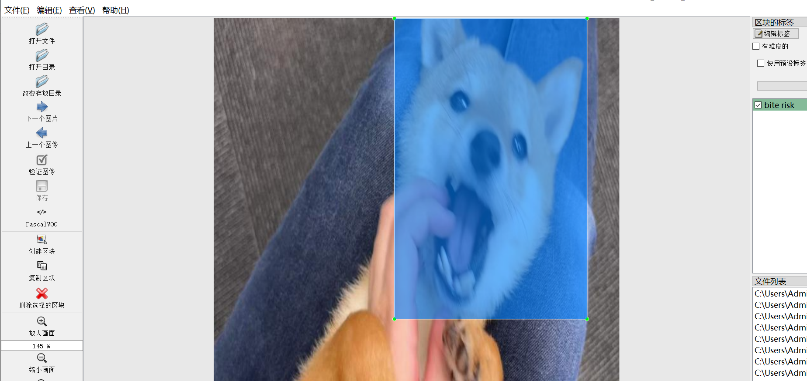
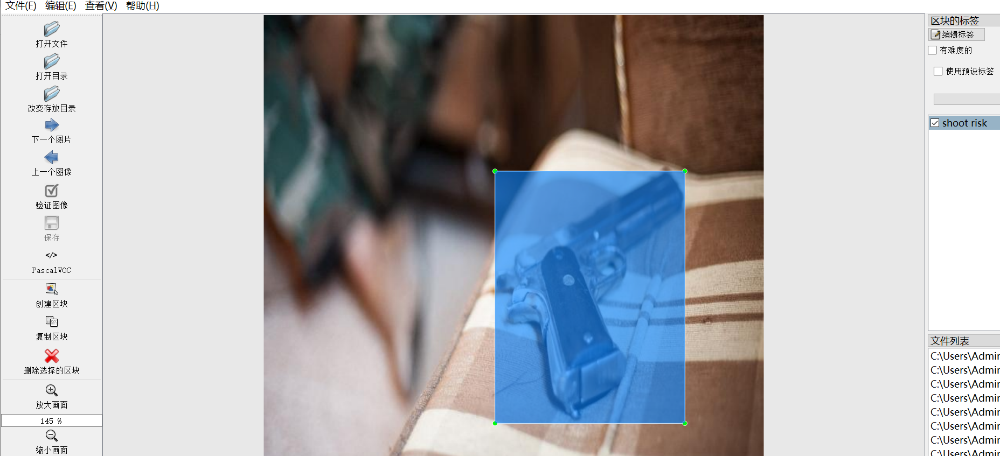
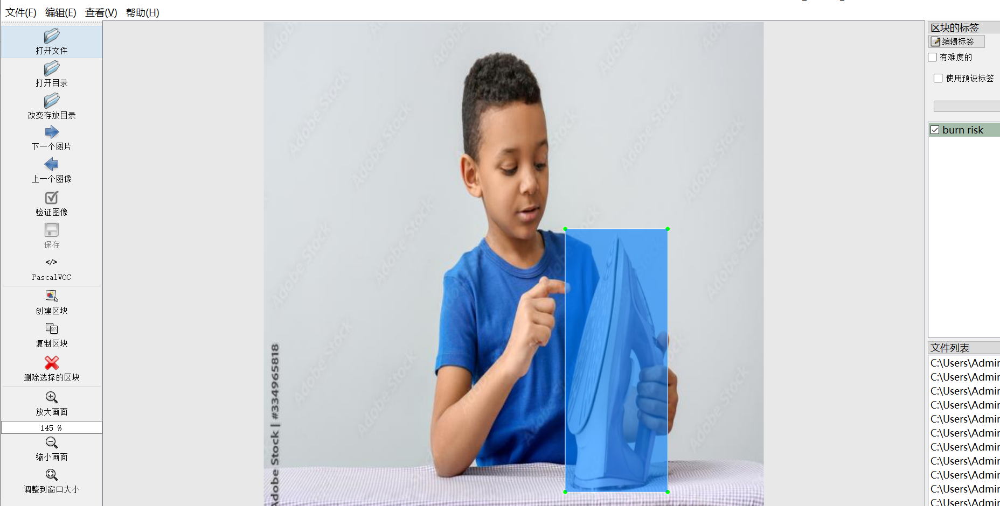

# [Object Detection] Item or Behavior Potentially Wind insurance Dataset 3400 images8-class（ Bite Burn Cut Fire Disaster Fall Touch Electric Shoot Wind insurance ）YOLO+VOC

Dataset Format: VOC format + YOLO format

The compressed file contains: three folders, each storing images, xml files, and text files.

Total jpg images in JPEGImages folder: 3406

The total number of XML files in the Annotations folder is: 3406.

The total number of txt files in the labels folder is 3,406.

Number of tag types: 8

Tag names: ["bite risk","burn risk","cut risk","electric shock risk","fall risk","fire risk","fog risk","shoot risk"]

Label Chinese meaning: Risk of puncture injury, burn risk, cut wound risk, electric shock risk, fall risk, fire risk, fog risk, shooting risk

The number of boxes for each label (Note that the order of labels in the Yolo format does not correspond to this, but is based on the classes.txt file in the labels folder):

bite risk frame count = 410

burn risk frame count = 618

cut risk frame count = 458

electric shock risk frame count = 427

fall risk frame count = 412

fire risk frame count = 504

fog risk frame count = 462

shoot risk frame count = 419

Total boxes: 3710

Picture clarity (Resolution: Pixels): Clear

Is the image enhanced: No

Shape of the label: Rectangular box, used for object detection and recognition.

Dataset Type ：199m

Special Notice: This dataset does not guarantee the accuracy or precision of the trained models or weight files. The dataset only provides accurate and reasonable annotations.

No specific annotation provided.

## Images

---

Here is a pay link on Stripe (https://buy.stripe.com/3cs8yP7sY87d0vu9AB). Please contact me lonlonago@foxmail.com after funding $89, and I will send you a complete data files, thank you!

